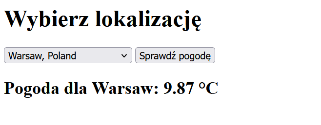
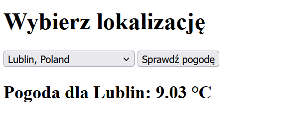
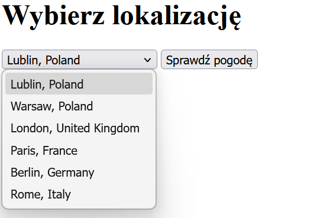

# Zadanie 1 Docker

## Zbudowanie obrazu
```bash
docker build -t lab_pogoda .
```
```bash
[+] Building 1.2s (15/15) FINISHED                        docker:default
 => [internal] load build definition from Dockerfile                0.0s
 => => transferring dockerfile: 808B                                0.0s
 => [internal] load metadata for docker.io/library/python:3.11-alp  0.8s
 => [internal] load metadata for docker.io/library/python:3.11-sli  0.8s
 => [internal] load .dockerignore                                   0.0s
 => => transferring context: 671B                                   0.0s
 => [builder 1/4] FROM docker.io/library/python:3.11-slim@sha256:6  0.1s
 => => resolve docker.io/library/python:3.11-slim@sha256:6d85378d8  0.1s
 => [stage-1 1/5] FROM docker.io/library/python:3.11-alpine@sha256  0.1s
 => => resolve docker.io/library/python:3.11-alpine@sha256:8b5bfdb  0.1s
 => [internal] load build context                                   0.0s
 => => transferring context: 63B                                    0.0s
 => CACHED [stage-1 2/5] WORKDIR /app                               0.0s
 => CACHED [stage-1 3/5] RUN adduser -D appuser                     0.0s
 => CACHED [builder 2/4] WORKDIR /app                               0.0s
 => CACHED [builder 3/4] COPY requirements.txt .                    0.0s
 => CACHED [builder 4/4] RUN pip install --user --no-cache-dir -r   0.0s
 => CACHED [stage-1 4/5] COPY --from=builder /root/.local /home/ap  0.0s
 => CACHED [stage-1 5/5] COPY --chown=appuser:appuser app.py .      0.0s
 => exporting to image                                              0.2s
 => => exporting layers                                             0.0s
 => => exporting manifest sha256:292156617988432445606eab5b3d20622  0.0s
 => => exporting config sha256:b022e43efe286e5d1e4aa321d340af4bd56  0.0s
 => => exporting attestation manifest sha256:d24962f41ab18988f3043  0.1s
 => => exporting manifest list sha256:8610d7ac5ac1d5a5287d68d3ed8c  0.0s
 => => naming to docker.io/library/lab_pogoda:latest                0.0s
 => => unpacking to docker.io/library/lab_pogoda:latest             0.0s
```

## Uruchomienie

```bash
docker run -d -p 5000:5000 -e WEATHER_API_KEY="kluczApi" --name pogoda_kontener lab_pogoda
```
```bash
e2ab790f2741fa2db48bdf7b49bf77cdfe49b854bb090346d39ae005950cedf2
```


## Docker logs
```bash
docker logs pogoda_kontener
```

```bash
Data uruchomienia: 2026-05-08 18:22:31.501571
Autor: Maksymilian Rachubik
Port TCP: 5000
 * Serving Flask app 'app'
 * Debug mode: off
WARNING: This is a development server. Do not use it in a production deployment. Use a production WSGI server instead.
 * Running on all addresses (0.0.0.0)
 * Running on http://127.0.0.1:5000
 * Running on http://172.17.0.2:5000
Press CTRL+C to quit
127.0.0.1 - - [08/May/2026 18:22:35] "GET /health HTTP/1.1" 200 -
```

## Informacje o obrazie
```bash
docker images lab_pogoda
```

```bash
IMAGE               ID             DISK USAGE   CONTENT SIZE   EXTRA
lab_pogoda:latest   8610d7ac5ac1       95.8MB           23MB    U   
```

## Historia

```bash
docker history lab_pogoda
```

```bash
IMAGE          CREATED         CREATED BY                                      SIZE      COMMENT
8610d7ac5ac1   6 minutes ago   CMD ["python" "app.py"]                         0B        buildkit.dockerfile.v0
<missing>      6 minutes ago   EXPOSE [5000/tcp]                               0B        buildkit.dockerfile.v0
<missing>      6 minutes ago   HEALTHCHECK &{["CMD-SHELL" "python -c \"impo…   0B        buildkit.dockerfile.v0
<missing>      6 minutes ago   USER appuser                                    0B        buildkit.dockerfile.v0
<missing>      6 minutes ago   ENV PYTHONUNBUFFERED=1                          0B        buildkit.dockerfile.v0
<missing>      6 minutes ago   ENV PATH=/home/appuser/.local/bin:/usr/local…   0B        buildkit.dockerfile.v0
<missing>      6 minutes ago   COPY --chown=appuser:appuser app.py . # buil…   12.3kB    buildkit.dockerfile.v0
<missing>      6 minutes ago   COPY /root/.local /home/appuser/.local # bui…   9.44MB    buildkit.dockerfile.v0
<missing>      6 minutes ago   LABEL org.opencontainers.image.authors=Maksy…   0B        buildkit.dockerfile.v0
<missing>      6 minutes ago   RUN /bin/sh -c adduser -D appuser # buildkit    41kB      buildkit.dockerfile.v0
```

## Sprawdzenie (healthy)

```bash
docker ps
```

```bash
CONTAINER ID   IMAGE        COMMAND           CREATED         STATUS                   PORTS                                         NAMES
e2ab790f2741   lab_pogoda   "python app.py"   3 minutes ago   Up 3 minutes (healthy)   0.0.0.0:5000->5000/tcp, [::]:5000->5000/tcp   pogoda_kontener
```

## Zrzuty ekranu z działania aplikacji



